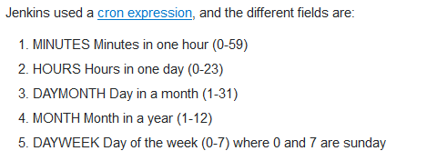

# Quicksort 

### Description
- Implements Quicksort algorithm with Maven
- Current version: 1.x

### Common commands

- Creating a project
```sh
mvn archetype:generate -DgroupId=devops -DartifactId=quicksort -DarchetypeArtifactId=maven-archetype-quickstart -DarchetypeVersion=1.4 -DinteractiveMode=false
```

- Build the project
```sh
mvn package # take the compiled code and package it in its distributable format, such as a JAR.

mvn verify # run any checks to verify the package is valid and meets quality criteria

mvn install # install the package into the local repository, for use as a dependency in other projects locally

mvn clean # cleans up artifacts created by prior builds

mvn site # generates site documentation for this project

# multiple phases at once
mvn clean install site
```

- Running a specific test
```sh
mvn -Dtest=QuicksortTestNG test # using TestNG
```

- Jenkins cronjob:

